# 🏀 ESR Basketball Academy - ERP Management System

Application web de gestion complète pour l'Académie de Basketball ESR, développée avec Ruby on Rails.


## 📸 Aperçu de l'application

### Tableau de bord principal

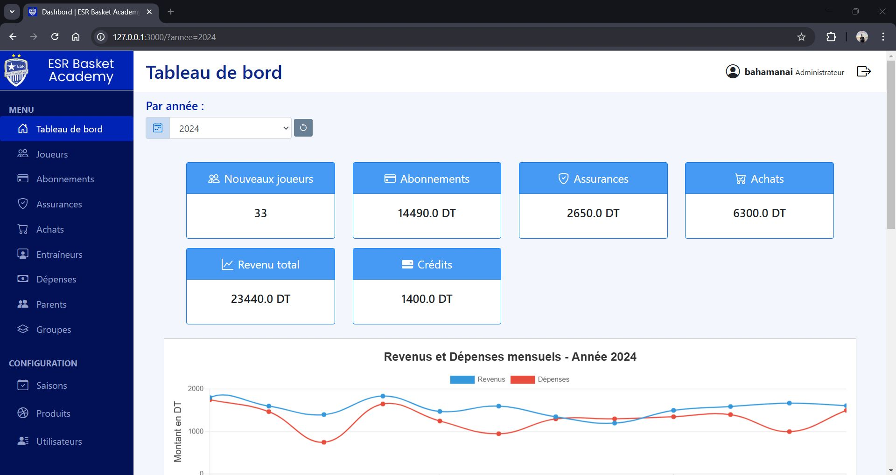

### Gestion des joueurs

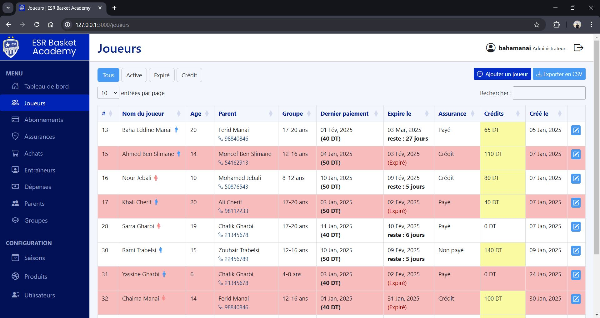

### Gestion des entraîneurs

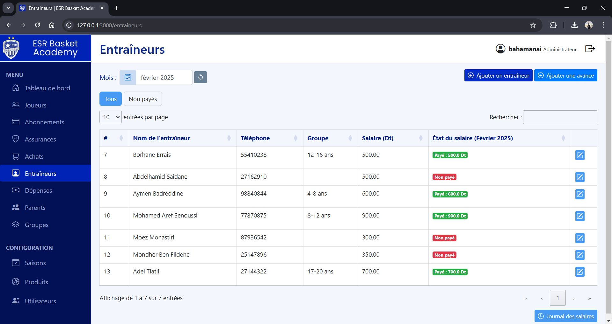

### Gestion financière

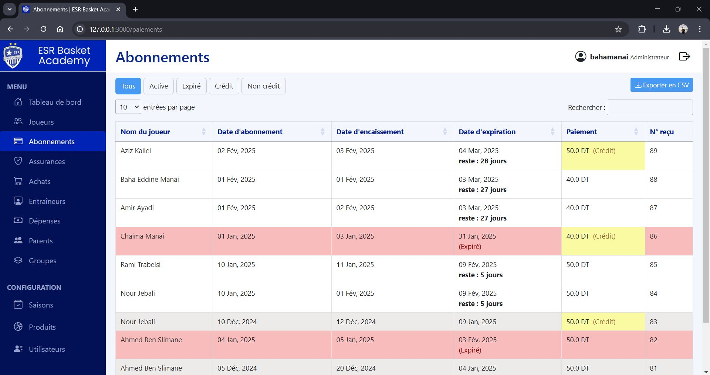

## 📋 Table des matières

- [Aperçu de l'application](#-aperçu-de-lapplication)
- [À propos](#à-propos)
- [Fonctionnalités](#fonctionnalités)
- [Technologies utilisées](#technologies-utilisées)
- [Prérequis](#prérequis)
- [Installation](#installation)
- [Configuration](#configuration)
- [Utilisation](#utilisation)
- [Structure du projet](#structure-du-projet)
- [Déploiement](#déploiement)
- [Galerie complète](#-galerie-complète)
- [Contribution](#contribution)
- [Licence](#licence)

## 🎯 À propos

Cette application a été conçue pour simplifier et automatiser la gestion quotidienne de l'ESR Basketball Academy. Elle permet de gérer efficacement les joueurs, les entraîneurs, les groupes, les abonnements, les assurances, les achats, les salaires et bien plus encore.

### Objectif

Centraliser toutes les opérations administratives de l'académie dans une interface unique, intuitive et performante, réduisant ainsi le temps de gestion et améliorant la prise de décision grâce à des tableaux de bord et des statistiques en temps réel.

## ✨ Fonctionnalités

### 📊 Tableau de bord dynamique

- Métriques mensuelles et annuelles
- Graphiques interactifs (Chart.js)
- Indicateurs de performance clés (KPI)
- Calcul automatique des surplus/déficits

### 👥 Gestion des entités

- **Joueurs** : Profils complets avec historique des paiements
- **Parents** : Informations de contact et liens avec les joueurs
- **Entraîneurs** : Gestion des profils et des salaires
- **Groupes** : Organisation par âge, horaires et terrains
- **Saisons** : Configuration des montants d'abonnement et d'assurance

### 💰 Gestion financière

- **Abonnements** : Suivi des paiements mensuels avec dates d'expiration
- **Assurances** : Gestion par saison
- **Achats** : Produits et équipements
- **Salaires** : Paiements mensuels des entraîneurs
- **Dépenses** : Suivi des dépenses diverses
- **Crédits** : Gestion des paiements différés

### 📈 Fonctionnalités avancées

- **Filtres intelligents** : Joueurs actifs, expirés, en crédit
- **Export CSV** : Exportation des données pour analyse externe
- **Recherche et pagination** : Tables dynamiques avec DataTables
- **Validation des données** : Côté serveur (Active Record) et client (Bootstrap)
- **Calculs automatiques** : Valeurs par défaut intelligentes
- **Numéros de reçu** : Génération automatique pour les paiements

### 🔐 Sécurité

- Authentification sécurisée avec Devise
- Gestion des rôles (Administrateur)
- Protection CSRF
- Validation des entrées

## 🛠 Technologies utilisées

### Backend

- **Ruby** 3.3.3
- **Rails** 7.1.6
- **SQLite3** (développement/test)
- **Puma** (serveur web)

### Frontend

- **HTML5** / **ERB** (templates)
- **CSS3** / **Bootstrap 5**
- **JavaScript** (ES6+)
- **Stimulus** (framework JS)
- **Turbo** (navigation SPA-like)

### Bibliothèques JavaScript

- **DataTables** - Tables interactives
- **Chart.js** / **Chartkick** - Graphiques
- **Flatpickr** - Sélecteur de dates

### Gems principales

- `devise` - Authentification
- `chartkick` + `groupdate` - Visualisation de données
- `bootsnap` - Optimisation du démarrage
- `kamal` - Déploiement Docker
- `sentry-ruby` / `sentry-rails` - Monitoring d'erreurs

### Outils de développement

- `rubocop-rails-omakase` - Linting Ruby
- `brakeman` - Analyse de sécurité
- `debug` - Débogage

## 📦 Prérequis

Avant de commencer, assurez-vous d'avoir installé :

- **Ruby** 3.3.3 ou supérieur
  - [Télécharger Ruby](https://www.ruby-lang.org/fr/downloads/)
  - Windows : [RubyInstaller](https://rubyinstaller.org/)
- **Node.js** 18+ et **Yarn**

  - [Télécharger Node.js](https://nodejs.org/)
  - Installer Yarn : `npm install -g yarn`

- **Git**

  - [Télécharger Git](https://git-scm.com/downloads)

- **SQLite3**
  - Généralement inclus avec Ruby sur Windows
  - Linux/Mac : `sudo apt-get install sqlite3` ou `brew install sqlite3`

## 🚀 Installation

### 1. Cloner le repository

```bash
git clone https://github.com/BahaManai/ESR-Basket-Academy-ERP-Rails-App.git
cd ESR-Basket-Academy-ERP-Rails-App
```

### 2. Installer les dépendances Ruby

```bash
bundle install
```

### 3. Installer les dépendances JavaScript

```bash
yarn install
```

### 4. Configurer la base de données

```bash
# Créer la base de données
rails db:create

# Exécuter les migrations
rails db:migrate

# Charger les données initiales (utilisateur admin)
rails db:seed
```

### 5. Lancer le serveur de développement

```bash
rails server
```

L'application sera accessible sur [http://localhost:3000](http://localhost:3000)

## 🔑 Connexion à l'application

⚠️ **IMPORTANT** : La page de connexion est la page d'accueil de l'application.

Après avoir exécuté `rails db:seed`, utilisez ces identifiants pour vous connecter :

```
Email : admin79@example.com
Mot de passe : securepassword
```

> 🔒 **Sécurité** : Ces identifiants sont uniquement pour le développement.
> Changez-les immédiatement en production via l'interface utilisateur !

## ⚙️ Configuration

### Variables d'environnement

Créez un fichier `.env` à la racine du projet pour les configurations sensibles (optionnel) :

```env
# Email (optionnel pour les notifications)
GMAIL_USERNAME=votre_email@gmail.com
GMAIL_PASSWORD=votre_mot_de_passe_app

# Sentry (optionnel pour le monitoring)
SENTRY_DSN=votre_sentry_dsn
```

### Configuration de la base de données

Le fichier `config/database.yml` est configuré pour utiliser SQLite3 par défaut.

Pour la production, il est recommandé d'utiliser PostgreSQL ou MySQL.

## 📖 Utilisation

### Créer une nouvelle saison

1. Accédez à **Saisons** dans le menu
2. Cliquez sur **Nouvelle saison**
3. Définissez les dates et les montants d'abonnement/assurance
4. Enregistrez

### Ajouter un joueur

1. Accédez à **Joueurs** → **Nouveau joueur**
2. Remplissez les informations (ou créez d'abord un parent)
3. Assignez à un groupe
4. Enregistrez

### Enregistrer un paiement

1. Accédez au profil du joueur (cliquez sur "Modifier")
2. Dans la section **Abonnements**, cliquez sur **Nouveau paiement**
3. Remplissez les informations
4. Le système calcule automatiquement la date d'expiration

### Exporter des données

1. Accédez à la liste des joueurs
2. Appliquez les filtres souhaités (actifs, expirés, crédits)
3. Cliquez sur **Exporter CSV**

## 📁 Structure du projet

```
ESR-Basket-Academy-ERP-Rails-App/
├── app/
│   ├── controllers/      # Contrôleurs (logique métier)
│   ├── models/           # Modèles (entités de données)
│   ├── views/            # Vues (templates ERB)
│   ├── javascript/       # JavaScript (Stimulus, custom)
│   ├── assets/           # CSS, images
│   └── helpers/          # Helpers pour les vues
├── config/
│   ├── routes.rb         # Routes de l'application
│   ├── database.yml      # Configuration BDD
│   └── environments/     # Configs par environnement
├── db/
│   ├── migrate/          # Migrations de base de données
│   ├── schema.rb         # Schéma actuel de la BDD
│   └── seeds.rb          # Données initiales
├── public/               # Fichiers statiques
├── test/                 # Tests (à développer)
├── Gemfile               # Dépendances Ruby
├── package.json          # Dépendances JavaScript
└── README.md             # Ce fichier
```

## 🐳 Déploiement

### Avec Kamal (Docker)

L'application est configurée pour être déployée avec Kamal :

```bash
# Configurer les secrets
nano .kamal/secrets

# Déployer
kamal setup
kamal deploy
```

### Avec Heroku

```bash
# Créer l'application
heroku create esr-basket-academy

# Ajouter PostgreSQL
heroku addons:create heroku-postgresql:mini

# Déployer
git push heroku main

# Migrer la base de données
heroku run rails db:migrate db:seed
```

### Avec un VPS (Linux)

1. Installer Ruby, Node.js, et un serveur web (Nginx)
2. Cloner le repository
3. Configurer la base de données (PostgreSQL recommandé)
4. Compiler les assets : `rails assets:precompile`
5. Lancer avec systemd ou un process manager

## 🖼️ Galerie complète

### Tableaux de bord et statistiques

<table>
  <tr>
    <td width="50%">
      
      <p align="center"><em>Tableau de bord - Métriques principales</em></p>
    </td>
    <td width="50%">
      
      <p align="center"><em>Tableau de bord - Graphiques et statistiques</em></p>
    </td>
  </tr>
</table>

### Gestion des joueurs

<table>
  <tr>
    <td width="50%">
      
      <p align="center"><em>Page des joueurs avec filtres et recherche</em></p>
    </td>
    <td width="50%">
      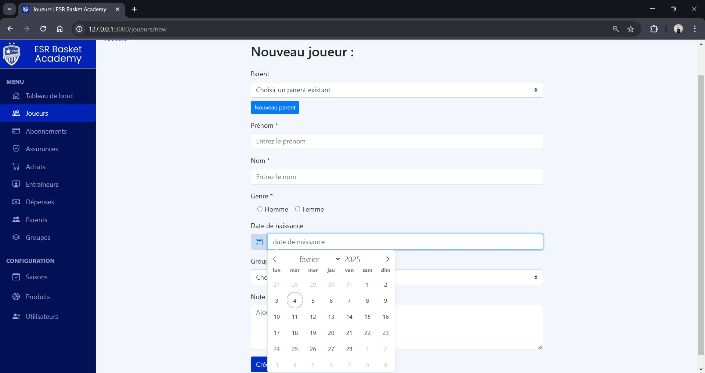
      <p align="center"><em>Formulaire d'ajout d'un nouveau joueur</em></p>
    </td>
  </tr>
  <tr>
    <td width="50%">
      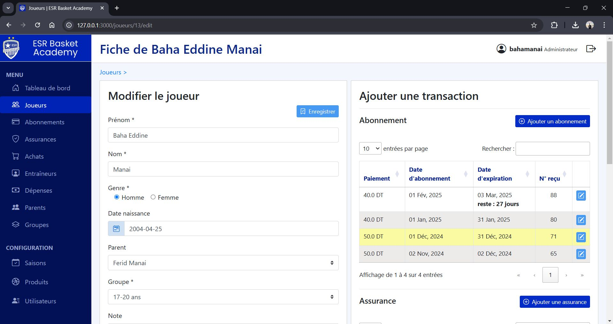
      <p align="center"><em>Page de gestion - Modification et transactions</em></p>
    </td>
    <td width="50%">
      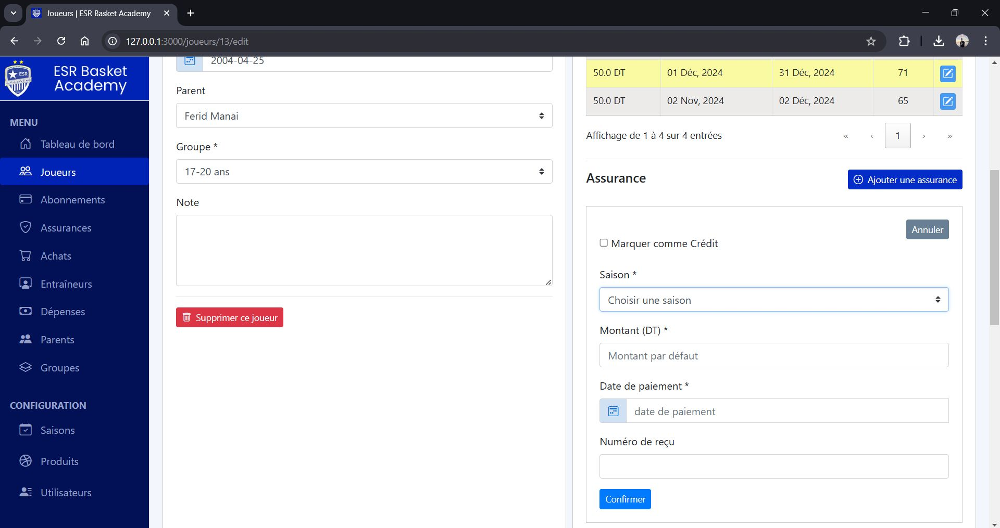
      <p align="center"><em>Page de gestion - Section assurance</em></p>
    </td>
  </tr>
  <tr>
    <td colspan="2">
      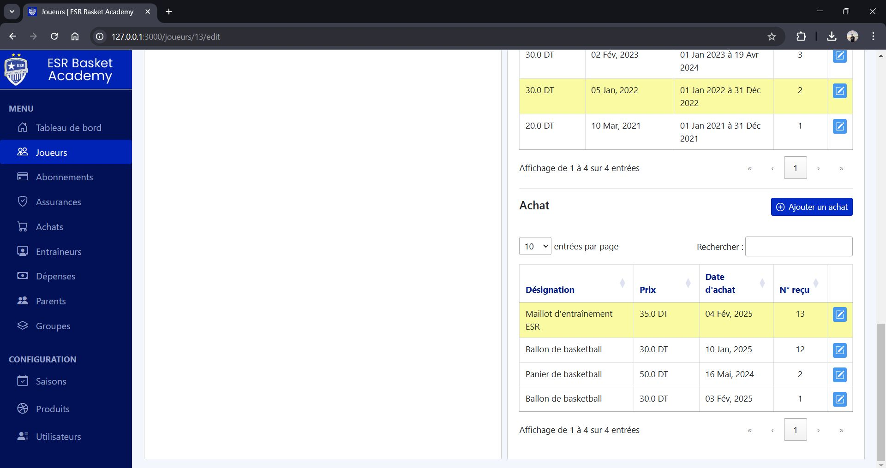
      <p align="center"><em>Page de gestion - Section achats et équipements</em></p>
    </td>
  </tr>
</table>

### Gestion financière

<table>
  <tr>
    <td width="50%">
      
      <p align="center"><em>Gestion des abonnements</em></p>
    </td>
    <td width="50%">
      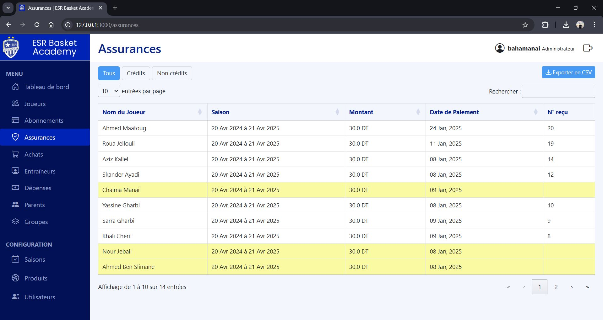
      <p align="center"><em>Gestion des assurances</em></p>
    </td>
  </tr>
  <tr>
    <td colspan="2">
      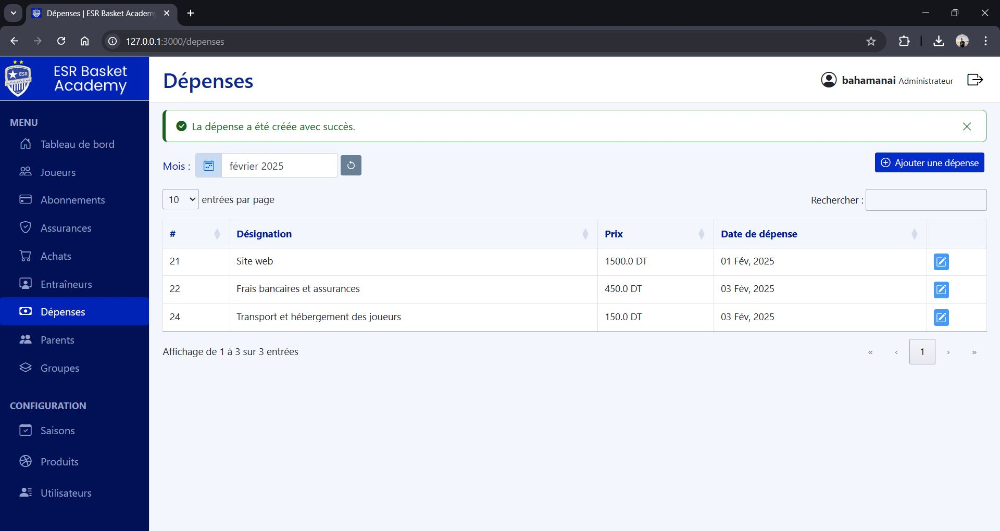
      <p align="center"><em>Suivi des dépenses</em></p>
    </td>
  </tr>
</table>

### Gestion des entraîneurs

<table>
  <tr>
    <td width="50%">
      
      <p align="center"><em>Page des entraîneurs</em></p>
    </td>
    <td width="50%">
      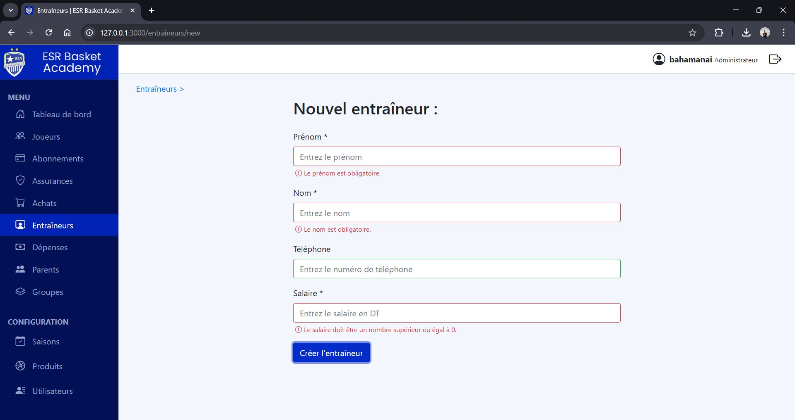
      <p align="center"><em>Formulaire avec validations côté client</em></p>
    </td>
  </tr>
  <tr>
    <td colspan="2">
      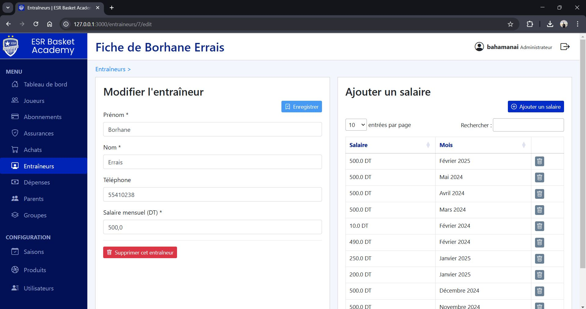
      <p align="center"><em>Page de gestion - Modification et ajout de salaire</em></p>
    </td>
  </tr>
</table>

### Gestion des groupes

<table>
  <tr>
    <td width="50%">
      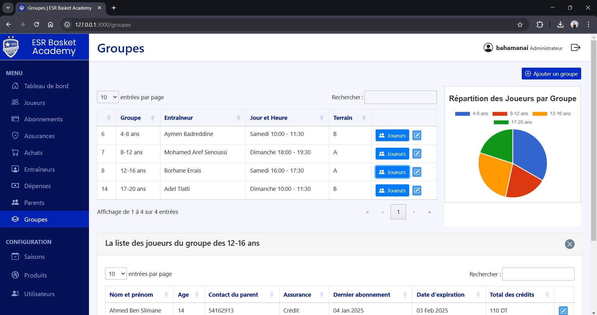
      <p align="center"><em>Liste des groupes</em></p>
    </td>
    <td width="50%">
      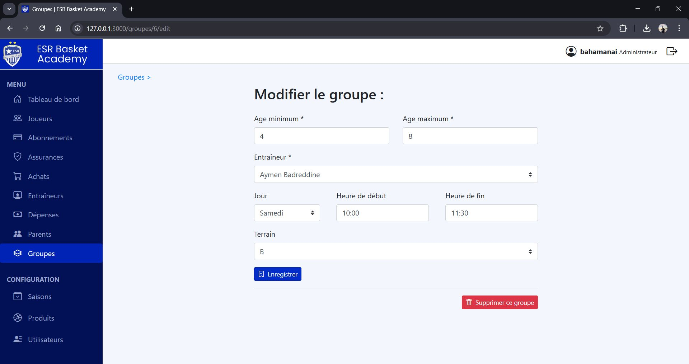
      <p align="center"><em>Formulaire de modification d'un groupe</em></p>
    </td>
  </tr>
</table>

### Authentification

<table>
  <tr>
    <td>
      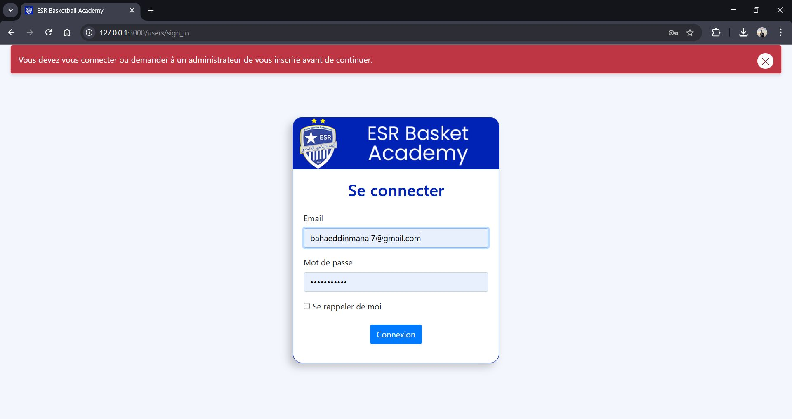
      <p align="center"><em>Page de connexion sécurisée</em></p>
    </td>
  </tr>
</table>

## 🤝 Contribution

Les contributions sont les bienvenues ! Pour contribuer :

1. Forkez le projet
2. Créez une branche pour votre fonctionnalité (`git checkout -b feature/AmazingFeature`)
3. Committez vos changements (`git commit -m 'Add some AmazingFeature'`)
4. Poussez vers la branche (`git push origin feature/AmazingFeature`)
5. Ouvrez une Pull Request

## 🐛 Problèmes connus

### Windows

- Les performances peuvent être plus lentes en développement
- Solution : Exclure le dossier du projet de Windows Defender ou utiliser WSL2

### SQLite3

- Limité pour les environnements de production avec beaucoup d'utilisateurs simultanés
- Solution : Migrer vers PostgreSQL ou MySQL en production

## 📝 Licence

Ce projet est sous licence MIT. Voir le fichier `LICENSE` pour plus de détails.

## 👨‍💻 Auteur

**Baha Manai**

- GitHub: [@BahaManai](https://github.com/BahaManai)

## 🙏 Remerciements

- L'équipe de l'ESR Basketball Academy
- La communauté Ruby on Rails
- Tous les contributeurs open source des gems utilisées

---

⭐ Si ce projet vous a été utile, n'hésitez pas à lui donner une étoile sur GitHub !
