# 🏀 ESR Basketball Academy - ERP Management System

Application web complète de gestion administrative et financière pour l'**ESR Basketball Academy**, développée avec **Ruby on Rails**.


---

## 📸 Aperçu de l'application

### Tableau de bord principal

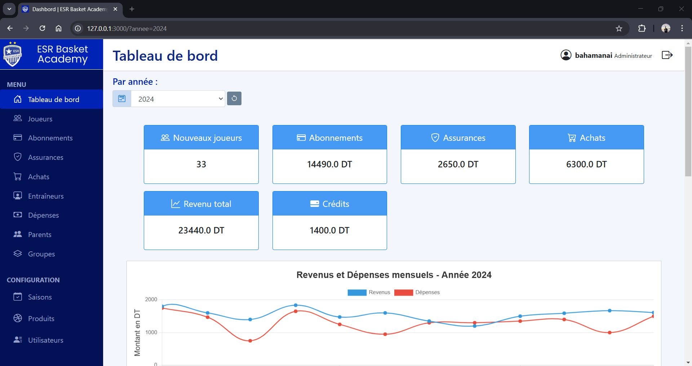

### Gestion des joueurs

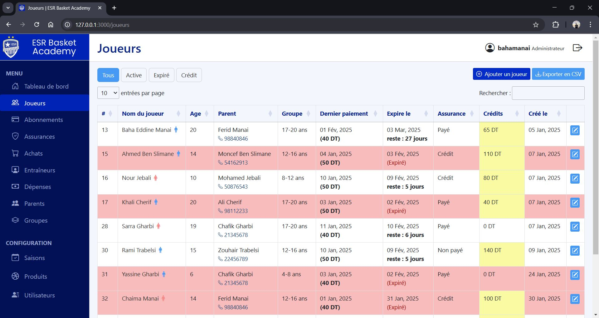

### Gestion des entraîneurs

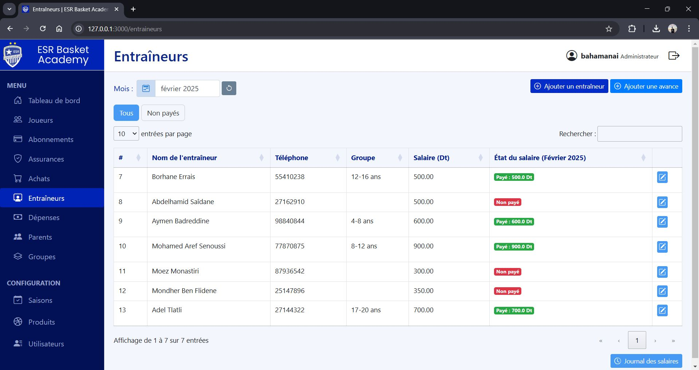

### Gestion financière

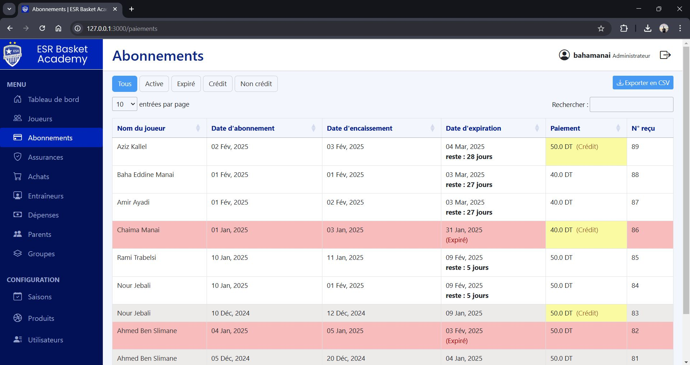

---

## 📋 Table des matières

- [📸 Aperçu de l'application](#-aperçu-de-lapplication)
- [🎯 À propos](#-à-propos)
- [🎯 Objectif du projet](#-objectif-du-projet)
- [✨ Fonctionnalités](#-fonctionnalités)
- [🛠 Technologies utilisées](#-technologies-utilisées)
- [📦 Prérequis](#-prérequis)
- [🚀 Installation](#-installation)
- [🔑 Connexion à l'application](#-connexion-à-lapplication)
- [⚙️ Configuration](#️-configuration)
- [📖 Utilisation](#-utilisation)
- [📁 Structure du projet](#-structure-du-projet)
- [🐳 Déploiement](#-déploiement)
- [🖼️ Galerie complète](#️-galerie-complète)
- [🤝 Contribution](#-contribution)
- [🐛 Problèmes connus](#-problèmes-connus)
- [📝 Licence](#-licence)
- [👨‍💻 Auteur](#-auteur)
- [🙏 Remerciements](#-remerciements)

---

## 🎯 À propos

Cette application a été conçue pour simplifier, organiser et automatiser la gestion quotidienne de l'**ESR Basketball Academy**.

Elle permet de centraliser dans une seule interface les opérations essentielles de l'académie :

- la gestion des joueurs ;
- la gestion des parents ;
- la gestion des entraîneurs ;
- la gestion des groupes ;
- la gestion des saisons ;
- le suivi des abonnements ;
- le suivi des assurances ;
- la gestion des achats ;
- la gestion des salaires ;
- le suivi des dépenses ;
- la gestion des crédits ;
- l'analyse financière à travers des tableaux de bord.

L'application vise à remplacer les suivis manuels dispersés par un système structuré, plus fiable et plus rapide à utiliser.

---

## 🎯 Objectif du projet

L'objectif principal du projet est de **centraliser toutes les opérations administratives et financières de l'académie** dans une plateforme unique, intuitive et performante.

Grâce à cette application, l'administration peut :

- gagner du temps sur les tâches répétitives ;
- réduire les erreurs de suivi manuel ;
- suivre les paiements et les échéances plus facilement ;
- consulter rapidement l'état financier de l'académie ;
- organiser les joueurs par groupes et saisons ;
- améliorer la prise de décision grâce aux statistiques et aux indicateurs.

Le système offre une meilleure visibilité sur l'activité globale de l'académie et facilite le suivi quotidien.

---

## ✨ Fonctionnalités

### 📊 Tableau de bord dynamique

Le tableau de bord fournit une vue globale sur les performances et les données importantes de l'académie.

Fonctionnalités principales :

- métriques mensuelles et annuelles ;
- statistiques financières ;
- graphiques interactifs avec Chart.js / Chartkick ;
- indicateurs de performance clés ;
- calcul automatique des surplus et déficits ;
- résumé des revenus, dépenses et soldes ;
- visualisation rapide de l'activité récente.

---

### 👥 Gestion des entités

L'application permet de gérer les principales entités liées à l'académie.

#### Joueurs

- création et modification des profils joueurs ;
- suivi des informations personnelles ;
- affectation à un groupe ;
- suivi des abonnements ;
- suivi des assurances ;
- suivi des achats ;
- historique des paiements.

#### Parents

- gestion des informations de contact ;
- association avec un ou plusieurs joueurs ;
- centralisation des informations familiales utiles.

#### Entraîneurs

- création des profils entraîneurs ;
- suivi des coordonnées ;
- gestion des salaires ;
- historique des paiements mensuels.

#### Groupes

- organisation des joueurs par âge ou catégorie ;
- définition des horaires ;
- affectation des terrains ;
- suivi des groupes actifs.

#### Saisons

- création et configuration des saisons sportives ;
- définition des dates de début et de fin ;
- configuration des montants d'abonnement ;
- configuration des montants d'assurance.

---

### 💰 Gestion financière

Le module financier permet de suivre avec précision les entrées et sorties d'argent.

#### Abonnements

- suivi des paiements mensuels ;
- dates d'expiration automatiques ;
- historique par joueur ;
- détection des abonnements expirés ;
- gestion des paiements en crédit.

#### Assurances

- gestion des assurances par saison ;
- suivi du statut de paiement ;
- association directe avec les joueurs.

#### Achats

- suivi des achats de produits ou équipements ;
- association avec les joueurs ;
- historique des transactions.

#### Salaires

- gestion des paiements des entraîneurs ;
- suivi mensuel ;
- historique par entraîneur.

#### Dépenses

- ajout des dépenses diverses ;
- catégorisation des charges ;
- suivi financier global.

#### Crédits

- gestion des paiements différés ;
- suivi des montants restants ;
- visibilité sur les joueurs ayant un crédit actif.

---

### 📈 Fonctionnalités avancées

L'application intègre plusieurs outils pour améliorer l'expérience d'utilisation et la productivité.

- filtres intelligents pour les joueurs actifs, expirés ou en crédit ;
- export CSV pour analyser les données en dehors de l'application ;
- recherche dynamique dans les tableaux ;
- pagination avec DataTables ;
- validations côté serveur avec Active Record ;
- validations côté client avec Bootstrap ;
- génération automatique des numéros de reçu ;
- calculs automatiques des montants et dates ;
- valeurs par défaut intelligentes dans les formulaires.

---

### 🔐 Sécurité

La sécurité est assurée par plusieurs mécanismes intégrés à Rails et à l'application.

- authentification sécurisée avec Devise ;
- accès administrateur ;
- protection CSRF ;
- validation des entrées utilisateur ;
- gestion des sessions ;
- séparation des données sensibles via variables d'environnement.

> ⚠️ Les identifiants par défaut fournis dans les seeds sont réservés au développement.
> Ils doivent être changés avant toute utilisation en production.

---

## 🛠 Technologies utilisées

### Backend

- **Ruby** 3.3.3
- **Ruby on Rails** 7.1.6
- **SQLite3** pour le développement et les tests
- **Puma** comme serveur web

---

### Frontend

- **HTML5**
- **ERB** pour les templates Rails
- **CSS3**
- **Bootstrap 5**
- **JavaScript ES6+**
- **Stimulus**
- **Turbo**

---

### Bibliothèques JavaScript

- **DataTables** : tableaux interactifs avec recherche et pagination
- **Chart.js** : graphiques dynamiques
- **Chartkick** : intégration simple des graphiques avec Rails
- **Flatpickr** : sélecteur de dates moderne

---

### Gems principales

- `devise` : authentification
- `chartkick` : visualisation de données
- `groupdate` : regroupement des données par date
- `bootsnap` : optimisation du temps de démarrage
- `kamal` : déploiement avec Docker
- `sentry-ruby` : monitoring des erreurs
- `sentry-rails` : intégration Sentry avec Rails

---

### Outils de développement

- `rubocop-rails-omakase` : linting Ruby/Rails
- `brakeman` : analyse de sécurité
- `debug` : débogage
- Rails console
- Rails migrations
- Seeds Rails

---

## 📦 Prérequis

Avant de lancer le projet, assurez-vous d'avoir installé les outils suivants.

### Ruby

Version recommandée :

```bash
ruby 3.3.3
```

Liens utiles :

- [Télécharger Ruby](https://www.ruby-lang.org/fr/downloads/)
- Windows : [RubyInstaller](https://rubyinstaller.org/)

---

### Rails

Version utilisée :

```bash
rails 7.1.6
```

---

### Node.js et Yarn

Node.js 18+ est recommandé.

Installer Yarn :

```bash
npm install -g yarn
```

Liens utiles :

- [Télécharger Node.js](https://nodejs.org/)

---

### Git

Git est nécessaire pour cloner le projet.

- [Télécharger Git](https://git-scm.com/downloads)

---

### SQLite3

SQLite3 est utilisé par défaut en développement et en test.

Installation Linux :

```bash
sudo apt-get install sqlite3
```

Installation macOS :

```bash
brew install sqlite3
```

Sur Windows, SQLite3 est généralement inclus avec RubyInstaller.

---

## 🚀 Installation

### 1. Cloner le dépôt

```bash
git clone https://github.com/BahaManai/ESR-Basket-Academy-ERP-Rails-App.git
cd ESR-Basket-Academy-ERP-Rails-App
```

---

### 2. Installer les dépendances Ruby

```bash
bundle install
```

---

### 3. Installer les dépendances JavaScript

```bash
yarn install
```

---

### 4. Configurer la base de données

Créer la base de données :

```bash
rails db:create
```

Exécuter les migrations :

```bash
rails db:migrate
```

Charger les données initiales :

```bash
rails db:seed
```

---

### 5. Lancer le serveur de développement

```bash
rails server
```

L'application sera accessible à l'adresse suivante :

```text
http://localhost:3000
```

---

## 🔑 Connexion à l'application

La page de connexion est la page d'accueil de l'application.

Après avoir exécuté la commande suivante :

```bash
rails db:seed
```

Vous pouvez utiliser le compte administrateur par défaut :

```text
Email : admin79@example.com
Mot de passe : securepassword
```

> 🔒 Important : ces identifiants sont uniquement destinés à l'environnement de développement.
> En production, vous devez les changer immédiatement depuis l'interface ou les seeds.

---

## ⚙️ Configuration

### Variables d'environnement

Vous pouvez créer un fichier `.env` à la racine du projet pour stocker les informations sensibles.

Exemple :

```env
# Email optionnel pour les notifications
GMAIL_USERNAME=votre_email@gmail.com
GMAIL_PASSWORD=votre_mot_de_passe_app

# Sentry optionnel pour le monitoring
SENTRY_DSN=votre_sentry_dsn
```

---

### Configuration de la base de données

Le fichier de configuration de la base de données se trouve ici :

```text
config/database.yml
```

Par défaut, l'application utilise SQLite3 pour le développement et les tests.

Pour un environnement de production, il est recommandé d'utiliser une base de données plus robuste, comme :

- PostgreSQL ;
- MySQL.

---

### Sécurité en production

Avant de déployer l'application en production, pensez à :

- changer les identifiants administrateur par défaut ;
- configurer les variables d'environnement ;
- utiliser une base de données adaptée à la production ;
- activer le monitoring des erreurs ;
- vérifier les secrets Rails ;
- exécuter les migrations ;
- précompiler les assets.

---

## 📖 Utilisation

### Créer une nouvelle saison

1. Accédez à la section **Saisons** depuis le menu.
2. Cliquez sur **Nouvelle saison**.
3. Définissez les dates de début et de fin.
4. Renseignez les montants d'abonnement et d'assurance.
5. Enregistrez la saison.

---

### Ajouter un joueur

1. Accédez à **Joueurs**.
2. Cliquez sur **Nouveau joueur**.
3. Remplissez les informations personnelles.
4. Créez ou associez un parent si nécessaire.
5. Assignez le joueur à un groupe.
6. Enregistrez le profil.

---

### Enregistrer un paiement d'abonnement

1. Accédez au profil du joueur.
2. Cliquez sur **Modifier** ou ouvrez la page de gestion du joueur.
3. Dans la section **Abonnements**, cliquez sur **Nouveau paiement**.
4. Renseignez les informations du paiement.
5. Le système calcule automatiquement la date d'expiration.
6. Enregistrez le paiement.

---

### Enregistrer une assurance

1. Accédez au profil du joueur.
2. Ouvrez la section **Assurance**.
3. Sélectionnez la saison concernée.
4. Ajoutez les informations de paiement.
5. Enregistrez.

---

### Gérer les salaires des entraîneurs

1. Accédez à la section **Entraîneurs**.
2. Ouvrez le profil de l'entraîneur.
3. Ajoutez un paiement de salaire.
4. Sélectionnez le mois concerné.
5. Enregistrez le paiement.

---

### Exporter des données

1. Accédez à la liste des joueurs.
2. Appliquez les filtres souhaités.
3. Cliquez sur **Exporter CSV**.
4. Utilisez le fichier exporté pour l'analyse ou l'archivage.

---

## 📁 Structure du projet

```text
ESR-Basket-Academy-ERP-Rails-App/
├── app/
│   ├── controllers/      # Contrôleurs Rails et logique applicative
│   ├── models/           # Modèles Active Record
│   ├── views/            # Vues ERB
│   ├── javascript/       # Stimulus, Turbo et JavaScript personnalisé
│   ├── assets/           # Images, styles et ressources front-end
│   └── helpers/          # Helpers utilisés dans les vues
├── config/
│   ├── routes.rb         # Routes de l'application
│   ├── database.yml      # Configuration de la base de données
│   └── environments/     # Configurations par environnement
├── db/
│   ├── migrate/          # Migrations de base de données
│   ├── schema.rb         # Schéma actuel de la base
│   └── seeds.rb          # Données initiales
├── public/               # Fichiers statiques publics
├── test/                 # Tests de l'application
├── Gemfile               # Dépendances Ruby
├── package.json          # Dépendances JavaScript
└── README.md             # Documentation du projet
```

---

## 🐳 Déploiement

### Déploiement avec Kamal

L'application peut être déployée avec **Kamal**.

Configurer les secrets :

```bash
nano .kamal/secrets
```

Préparer le serveur :

```bash
kamal setup
```

Déployer l'application :

```bash
kamal deploy
```

---

### Déploiement avec Heroku

Créer l'application Heroku :

```bash
heroku create esr-basket-academy
```

Ajouter PostgreSQL :

```bash
heroku addons:create heroku-postgresql:mini
```

Déployer le projet :

```bash
git push heroku main
```

Exécuter les migrations et les seeds :

```bash
heroku run rails db:migrate db:seed
```

---

### Déploiement avec un VPS Linux

Étapes recommandées :

1. Installer Ruby, Node.js, Yarn et Git.
2. Installer et configurer PostgreSQL ou MySQL.
3. Installer un serveur web comme Nginx.
4. Cloner le dépôt sur le serveur.
5. Installer les dépendances avec `bundle install` et `yarn install`.
6. Configurer les variables d'environnement.
7. Exécuter les migrations.
8. Précompiler les assets.
9. Lancer l'application avec Puma, systemd ou un process manager.

Précompiler les assets :

```bash
rails assets:precompile
```

---

## 🖼️ Galerie complète

### Tableaux de bord et statistiques

<table>
  <tr>
    <td width="50%">
      
      <p align="center"><em>Tableau de bord - Métriques principales</em></p>
    </td>
    <td width="50%">
      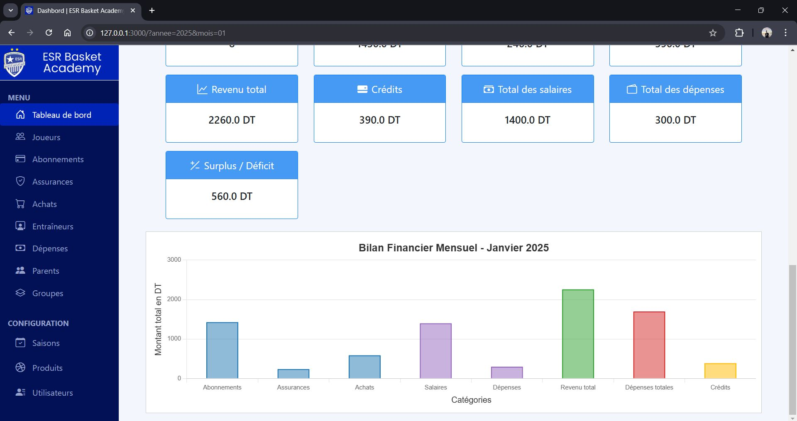
      <p align="center"><em>Tableau de bord - Graphiques et statistiques</em></p>
    </td>
  </tr>
</table>

---

### Gestion des joueurs

<table>
  <tr>
    <td width="50%">
      
      <p align="center"><em>Page des joueurs avec filtres et recherche</em></p>
    </td>
    <td width="50%">
      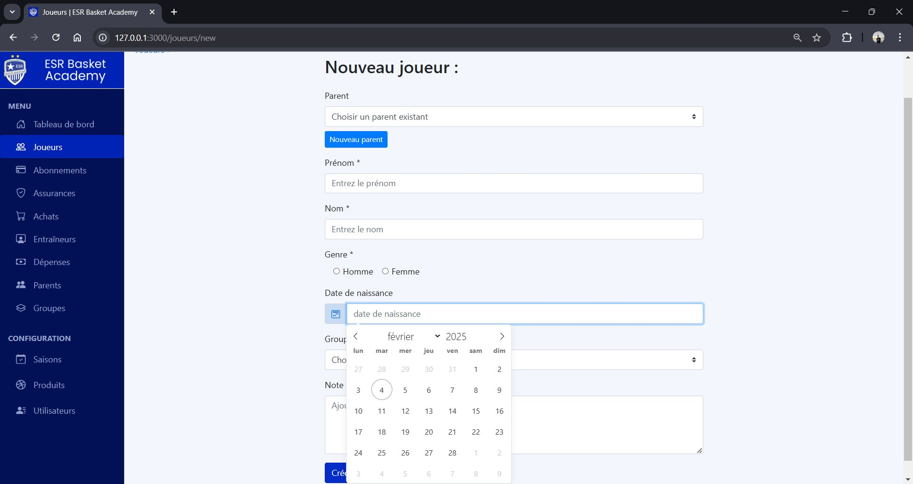
      <p align="center"><em>Formulaire d'ajout d'un nouveau joueur</em></p>
    </td>
  </tr>
  <tr>
    <td width="50%">
      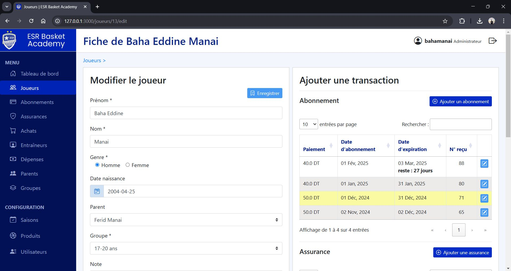
      <p align="center"><em>Page de gestion - modification et transactions</em></p>
    </td>
    <td width="50%">
      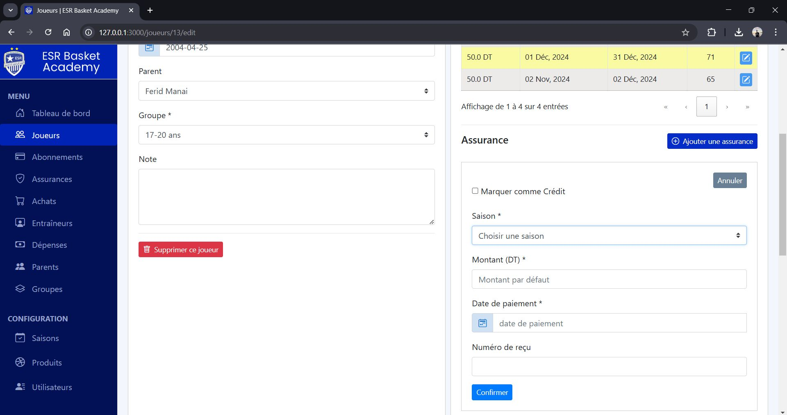
      <p align="center"><em>Page de gestion - section assurance</em></p>
    </td>
  </tr>
  <tr>
    <td colspan="2">
      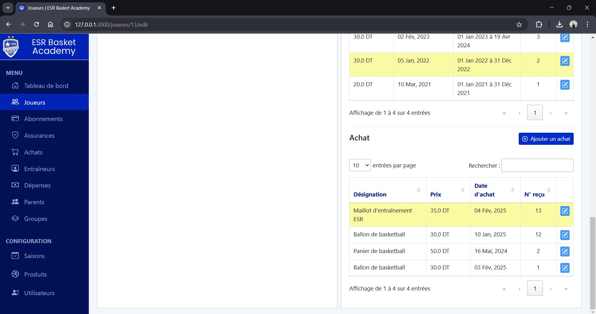
      <p align="center"><em>Page de gestion - achats et équipements</em></p>
    </td>
  </tr>
</table>

---

### Gestion financière

<table>
  <tr>
    <td width="50%">
      
      <p align="center"><em>Gestion des abonnements</em></p>
    </td>
    <td width="50%">
      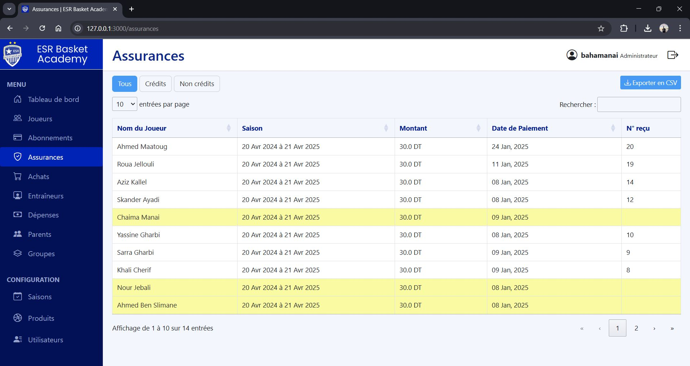
      <p align="center"><em>Gestion des assurances</em></p>
    </td>
  </tr>
  <tr>
    <td colspan="2">
      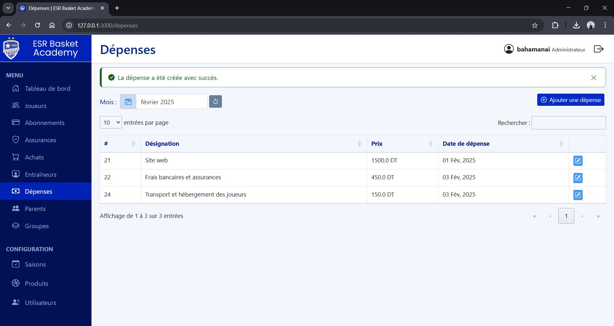
      <p align="center"><em>Suivi des dépenses</em></p>
    </td>
  </tr>
</table>

---

### Gestion des entraîneurs

<table>
  <tr>
    <td width="50%">
      
      <p align="center"><em>Page des entraîneurs</em></p>
    </td>
    <td width="50%">
      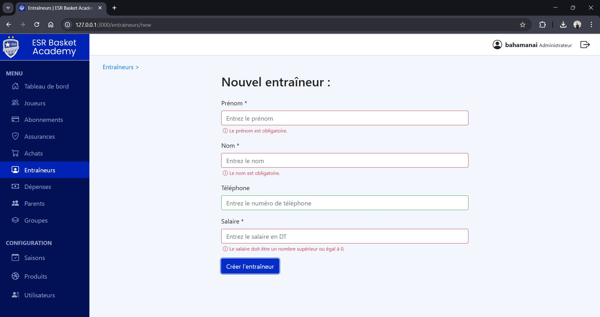
      <p align="center"><em>Formulaire avec validations côté client</em></p>
    </td>
  </tr>
  <tr>
    <td colspan="2">
      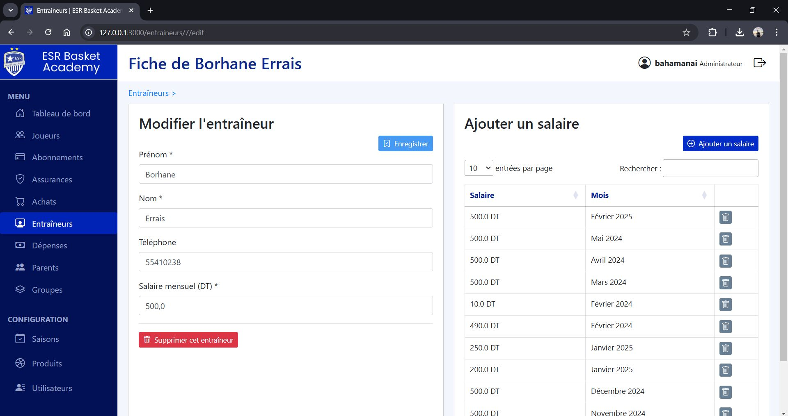
      <p align="center"><em>Page de gestion - modification et ajout de salaire</em></p>
    </td>
  </tr>
</table>

---

### Gestion des groupes

<table>
  <tr>
    <td width="50%">
      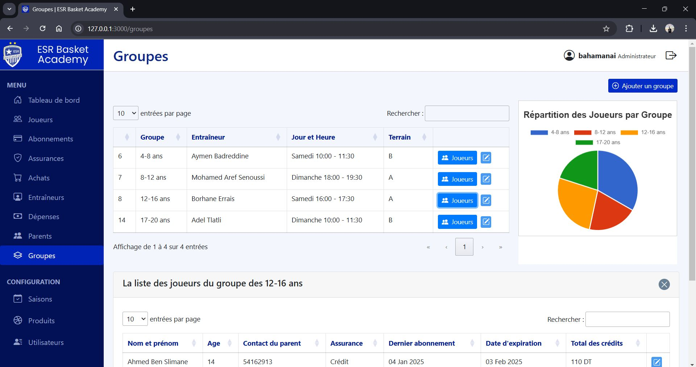
      <p align="center"><em>Liste des groupes</em></p>
    </td>
    <td width="50%">
      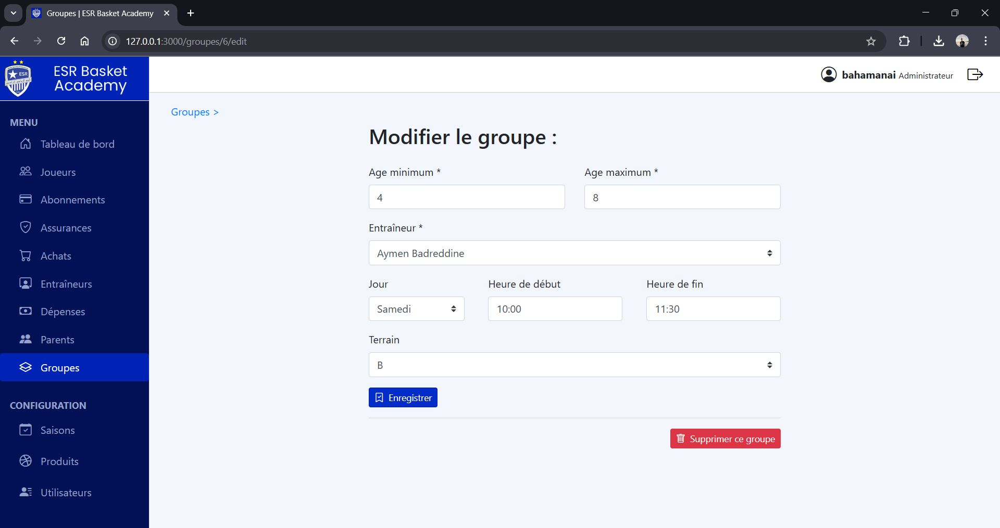
      <p align="center"><em>Formulaire de modification d'un groupe</em></p>
    </td>
  </tr>
</table>

---

### Authentification

<table>
  <tr>
    <td>
      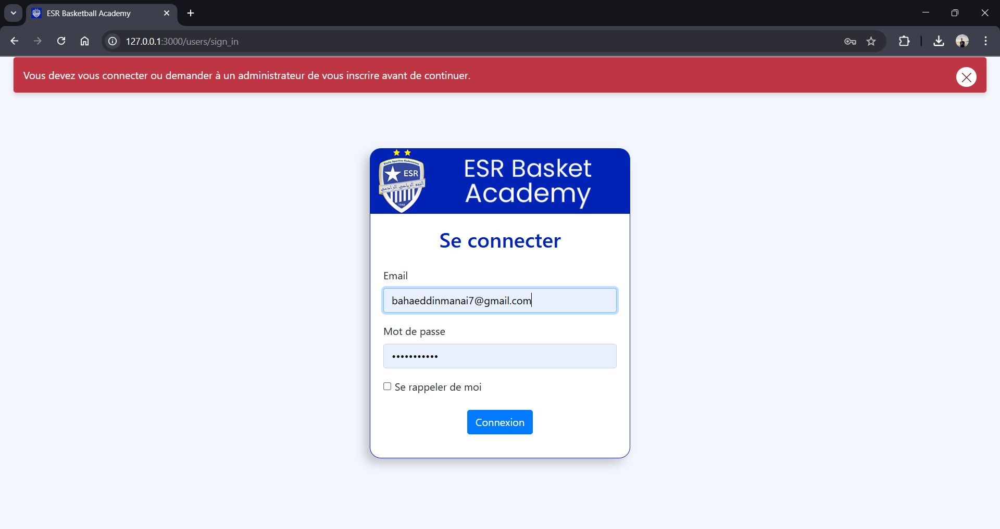
      <p align="center"><em>Page de connexion sécurisée</em></p>
    </td>
  </tr>
</table>

---

## 🤝 Contribution

Les contributions sont les bienvenues.

Pour contribuer :

1. Forkez le projet.
2. Créez une branche pour votre fonctionnalité :

```bash
git checkout -b feature/AmazingFeature
```

3. Commitez vos changements :

```bash
git commit -m "Add AmazingFeature"
```

4. Poussez vers votre branche :

```bash
git push origin feature/AmazingFeature
```

5. Ouvrez une Pull Request.

---

### Bonnes pratiques de contribution

Avant de proposer une contribution, pensez à :

- vérifier que l'application démarre correctement ;
- tester les fonctionnalités modifiées ;
- respecter la structure existante du projet ;
- écrire des noms de commits clairs ;
- éviter de commiter des fichiers sensibles comme `.env`.

---

## 🐛 Problèmes connus

### Windows

Les performances peuvent être plus lentes en environnement de développement.

Solutions possibles :

- exclure le dossier du projet de Windows Defender ;
- utiliser WSL2 ;
- éviter de placer le projet dans un dossier synchronisé avec un cloud.

---

### SQLite3

SQLite3 est pratique pour le développement, mais peut être limité en production avec plusieurs utilisateurs simultanés.

Solution recommandée :

- migrer vers PostgreSQL ou MySQL en production.

---

## 📝 Licence

Ce projet est sous licence **MIT**.

Voir le fichier `LICENSE` pour plus de détails.

---

## 👨‍💻 Auteur

**Baha Manai**

- GitHub : [@BahaManai](https://github.com/BahaManai)

---

## 🙏 Remerciements

- L'équipe de l'ESR Basketball Academy
- La communauté Ruby on Rails
- Les mainteneurs des gems utilisées
- Tous les contributeurs open source

---

⭐ Si ce projet vous a été utile, n'hésitez pas à lui donner une étoile sur GitHub !
